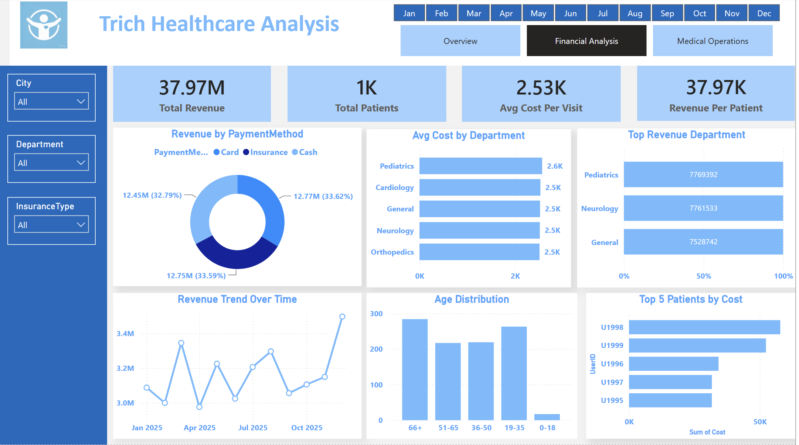
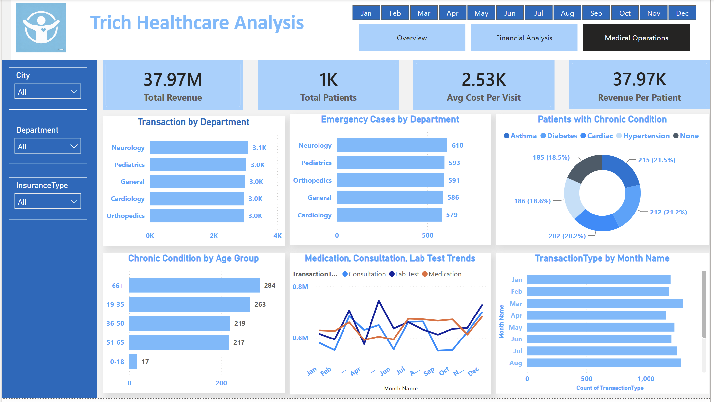

# 🏥 Trich Healthcare Analysis

Power BI Dashboard Project | £37.97M Revenue | 1,000 Patients | 3-Page Interactive Report

## 📚 Table of Contents
- [Project Overview](#project-overview)
- [Tools & Technologies](#tools--technologies)
- [Dataset Breakdown](#dataset-breakdown)
- [Dashboard Walkthrough](#dashboard-walkthrough)
- [Key Insights & Findings](#key-insights--findings)
- [Recommendations](#recommendations)

---

## Project Overview

This self-initiated project builds a three-page interactive Power BI dashboard 
to monitor financial performance, patient demographics and medical operations 
for Trich Healthcare. The goal was to transform raw operational data into clear, 
actionable insights that support both strategic and day-to-day decision-making 
across the organisation.

The dashboard is designed to serve multiple stakeholder needs — from executive 
financial overview to departmental operational metrics — with full interactivity 
through city, department, insurance type and monthly filters.

---

## Tools & Technologies

- Power BI — dashboard design and interactive reporting
- DAX — measures and KPIs
- Power Query — data cleaning and transformation

---

## Dataset Breakdown

- 1,000 patients across five departments
- Revenue data — total, by department, by month, by payment method
- Patient demographics — age group, gender, city, insurance type
- Medical operations — emergency cases, chronic conditions, transaction types
- Five departments — Pediatrics, Neurology, General, Cardiology, Orthopedics
- Five cities — Leeds, Manchester, Liverpool, London, Birmingham
- Three insurance types — Private, Corporate, Public
- Transaction types — Lab Test, Medication, Surgery, Emergency, Consultation

---

## Dashboard Walkthrough

### Page 1 — Overview

The first page provides a high-level summary of organisational performance.
Key metrics include £37.97M total revenue, 1,000 total patients, £2.53K 
average cost per visit and £37.97K revenue per patient.

Supporting visuals break down revenue by month, revenue by department, 
transaction type distribution, patients by gender, patients by city and 
patients by insurance type — giving stakeholders a complete picture of 
both financial and demographic performance at a glance.

---

### Page 2 — Financial Analysis

The second page drills into the financial detail. Key visuals include 
revenue by payment method — Card (33.62%), Cash (33.59%) and Insurance 
(32.79%) — showing a remarkably even split across all three methods.

Average cost by department is consistent across all five departments at 
approximately £2.5K, with Pediatrics marginally highest at £2.6K. 
Pediatrics also leads in total revenue at £7.77M, followed closely by 
Neurology at £7.76M. The revenue trend over time and age distribution 
charts surface patterns in patient flow and financial performance 
across the year.

---

### Page 3 — Medical Operations

The third page covers operational metrics. Neurology leads in both 
transaction volume (3.1K) and emergency cases (610), followed closely 
by Pediatrics in both categories. Chronic conditions are evenly 
distributed across four types — Asthma, Diabetes, Cardiac and 
Hypertension — each at approximately 20% of the patient base.

The 66+ age group carries the highest chronic condition burden at 284 
patients, followed by the 19-35 group at 263 — a counterintuitive 
finding suggesting younger adults may be underdiagnosed or presenting 
with early onset conditions. Medication, consultation and lab test 
trends move in parallel across the year with a sharp rise toward 
December.

---

## Key Insights & Findings

1. **Pediatrics is the highest revenue department** — generating £7.77M 
and leading in emergency cases and transactions, making it the most 
operationally intensive department requiring the most resource allocation.

2. **Payment methods are evenly distributed** — Card, Cash and Insurance 
each account for approximately one third of transactions, suggesting no 
single payment channel dominates and all three must be maintained and 
optimised equally.

3. **Average cost per visit is consistent across departments** — ranging 
narrowly between £2.5K and £2.6K, indicating standardised pricing 
regardless of department or treatment type.

4. **Young adults (19-35) carry an unexpectedly high chronic condition 
burden** — second only to the 66+ age group, suggesting a need for 
targeted early intervention programmes for younger patients.

5. **Revenue trends sharply upward toward December** — consistent with 
increased medical activity during winter months, supporting the case 
for seasonal resource and staffing planning.

6. **Leeds has the highest patient volume** at 223, followed by 
Manchester (201) and Liverpool (200) — indicating the northern cities 
drive the majority of patient activity.

---

## Recommendations

1. **Prioritise Pediatrics resourcing** — as the highest revenue and 
highest emergency volume department, staffing and equipment allocation 
should reflect its operational dominance.

2. **Investigate the 19-35 chronic condition finding** — the high 
prevalence of chronic conditions in younger adults warrants a targeted 
screening and early intervention programme to reduce long-term 
operational burden.

3. **Plan for December capacity surge** — the consistent year-end 
rise in medication, consultation and lab test activity should inform 
advance staffing, supply chain and bed capacity planning.

4. **Maintain all three payment channels equally** — the even 
distribution across Card, Cash and Insurance means over-investing 
in any single payment method would not meaningfully improve 
revenue collection efficiency.

5. **Expand presence in London and Birmingham** — with the lowest 
patient volumes at 195 and 181 respectively despite being major 
cities, there is a clear growth opportunity in these markets.
